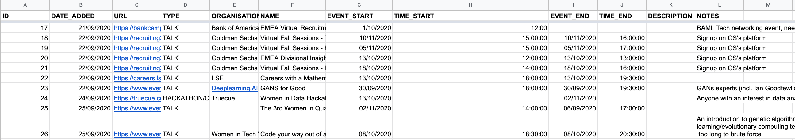
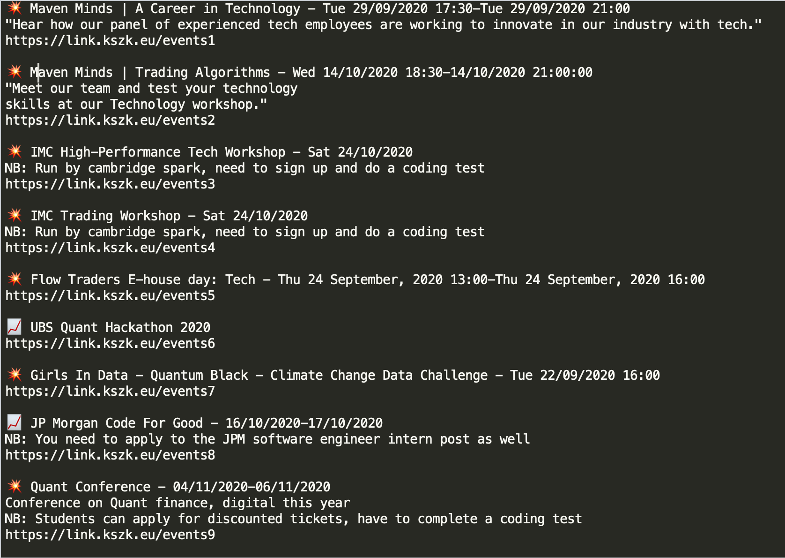

# opportunities
A  CRUD web app to record opportunities (careers events, jobs, hackathons) posted in the society


This is an example table, there are two: JOBS and EVENTS (currently just a Google Sheet) which store a list of jobs posting and relevant events, and their associated information



The current schema is as follows:

```EVENTS``` table schema

| ID | DATE_ADDED | URL | TYPE | ORGANISATION | NAME | EVENT_START | TIME_START | EVENT_END | TIME_END| DESCRIPTION | NOTES |
| --- | --- | --- | --- | --- | --- | --- | --- | --- | --- | --- | --- |
| --- | --- | --- | --- | --- | --- | --- | --- | --- | --- | --- | --- | 


```JOBS``` table schema

| ID | DATE_ADDED | URL | COMPANY_NAME | POST_NAME | LEVEL | LOCATION | DEADLINE | DESCRIPTION |
| --- | --- | --- | --- | --- | --- | --- | --- | --- |
| --- | --- | --- | --- | --- | --- | --- | --- | --- |


The ```jobs_script.py``` produces formatted output from the table (ideally it should support a SELECT WHERE DATE_POSTED > x query) which can be posted in Zulip / Newsletter



The next step currently is a link shortener service which is hosted on a seperate thing. It allow us to log number of clicks, which will be useful for finding out what members are interested in. Every link needs to be added manually, with the user specifying the shortened url (currently something like "events1", but should really be a hash like "abc123"). There is ```auto_add```


```auto_add(config, ``` in ```jobs.script.py``` will populate the link shortener service with the links to be added


## Requirements

Install : selenium, numpy, pandas, chromedriver

## Todos

Ideally the whole workflow should be integrated, an end user should be able to add a new events / job posting to the database via a front-end interface or API, the shortened link should be made automatically and there should be a ```/format_output``` method to print the unposted postings
